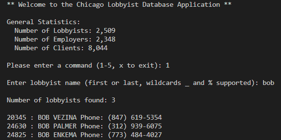
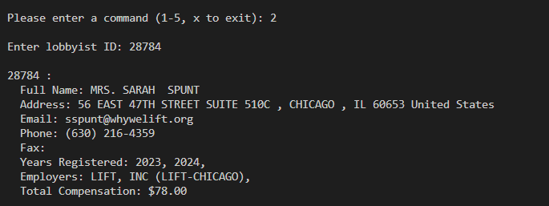
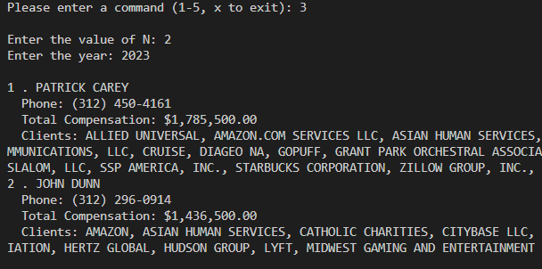

# Chicago Lobbyist Database App

## Overview
**Chicago Lobbyist Database Application**  
*Project 2, CS 341, Spring 2024, UIC CS*  

- Created a multi-tier application designed to interact with public information from the Chicago Lobbyist Database. This project was developed as part of the coursework for CS 341.
- Designed a user-friendly console-based interface that allows users to query and update lobbyist information effectively without direct SQL command interaction.
- Integrated SQLite database handling with Python to manage data retrieval and updates through a clean, modular architecture consisting of presentation, object mapping, and data tier layers.
- Developed functionality for detailed queries such as looking up lobbyists by name using SQL wildcards, fetching detailed lobbyist profiles, and retrieving top lobbyists by compensation for specific years.
- Implemented robust error handling and input validation to ensure reliability and usability of the application.
- Conducted thorough testing of each function to ensure accuracy and efficiency of the database queries and updates.
- Explored further enhancements like web integration and API development for broader accessibility and user engagement.

## Features
- **Lookup Lobbyists by Name**: Allows users to search for lobbyists using their first or last names, with support for SQL wildcards.
- **Detailed Lobbyist Information**: Users can view detailed information about a lobbyist, including contact details and registration history.
- **Top N Lobbyists by Compensation**: Finds the top N lobbyists based on total compensation for a specified year.
- **Register Lobbyist for New Year**: Allows adding a lobbyist to the database for a new registration year.
- **Set Salutation for a Lobbyist**: Users can update or set the salutation for a lobbyist.

## Installation
To set up the Chicago Lobbyist Database App, follow these steps:

1. Clone the repository:
   ```bash
   git clone https://github.com/fil-ski/CTA-DB-APP.git
2. Navigate to the project directory:
    ```bash
   cd CTA-DB-APP
3. To start the application
   ```bash
   python main.py

## How to Use
Below are step-by-step instructions for each feature of the application.

### **Lookup Lobbyists by Name**
1. **Enter the command `1` when prompted.**
2. **Input the name or partial name with wildcards.**
3. **View the list of matching lobbyists.**



### **Detailed Lobbyist Information**
1. **Enter the command `2` when prompted.**
2. **Input the lobbyist ID to fetch their detailed profile.**



### **Top N Lobbyists**
1. **Enter the command `3` when prompted.**
2. **Input the number `N` and the year to retrieve the top N lobbyists for that year.**



### **Register a Lobbyist**
1. **Enter the command `4` when prompted.**
2. **Provide the lobbyist ID and the new year they should be registered for.**

### **Set Salutation**
1. **Enter the command `5` when prompted.**
2. **Input the lobbyist ID and the new salutation.**


